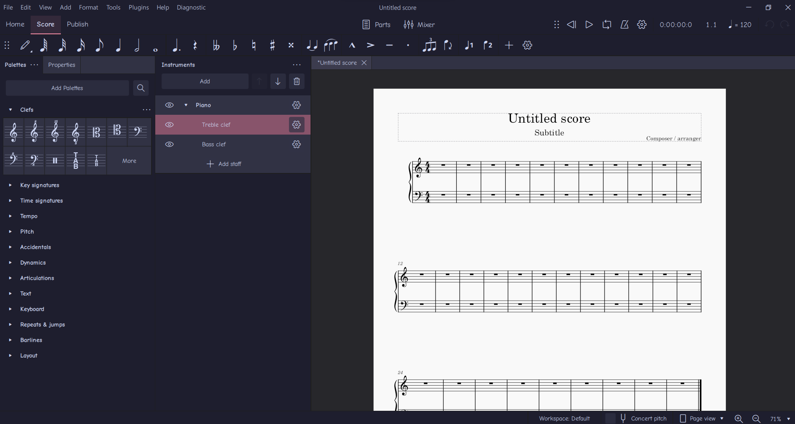

# catppuccin-ms4
A catppuccin theme for Musescore4 based off the <a href="https://github.com/catppuccin/catppuccin/">catppuccin theme</a>

**note : direction only for Windows because I do not know how Mac / Linux Works**
1. Press <code>windows + r</code> and insert <code>%appdata%</code> and press OK
2. Go to <code>AppData/roaming/Musescore4/MuseScore4.ini</code>
3. Choose theme (Latte)

🌿 Mocha

<table>
	<tr>
		<th></th>
		<th>Accent</th>
		<th>Code</th>
	</tr>
    <tr>
		<td></td>
		<td>Rosewater</td>
		<td><code>#dc8a78</code></td>
		<td><code>rgb(220, 138, 120)</code></td>
		<td><code>hsl(11, 59%, 67%)</code></td>
	</tr>
</table>

